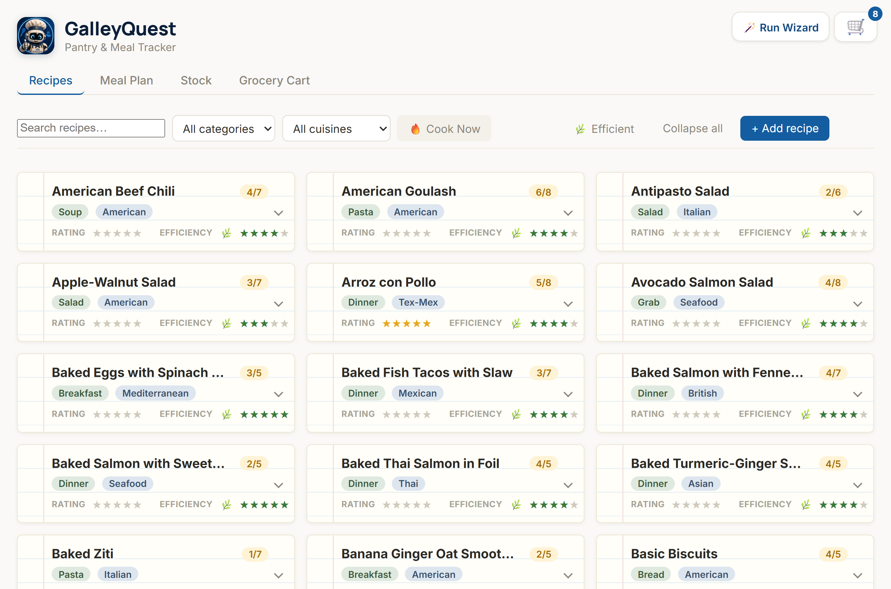
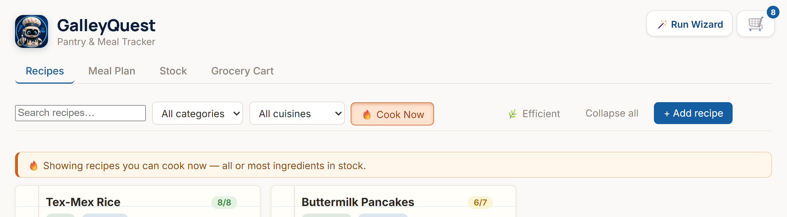
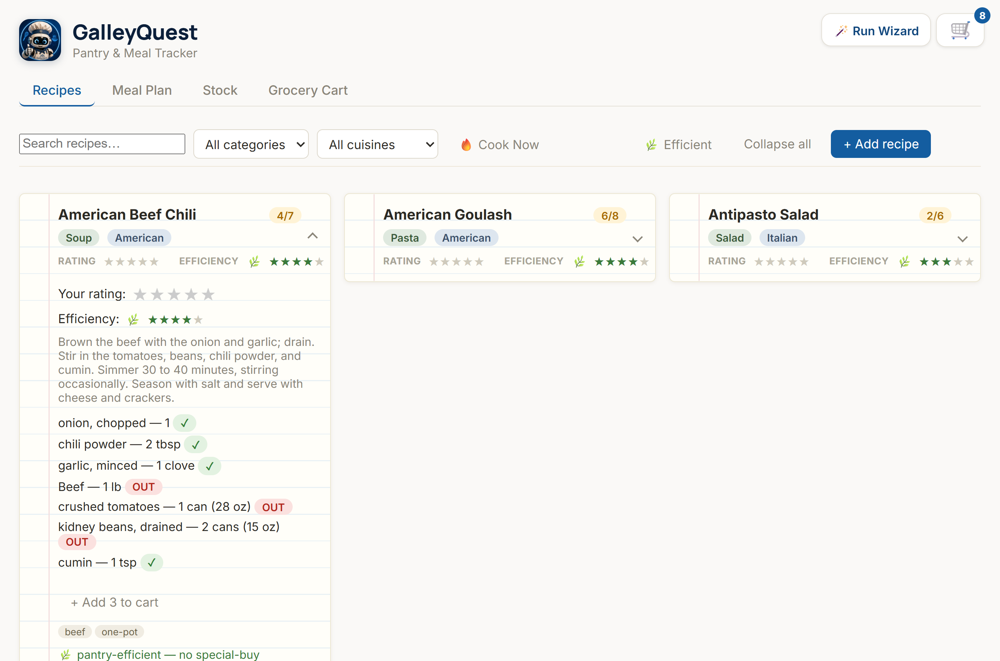
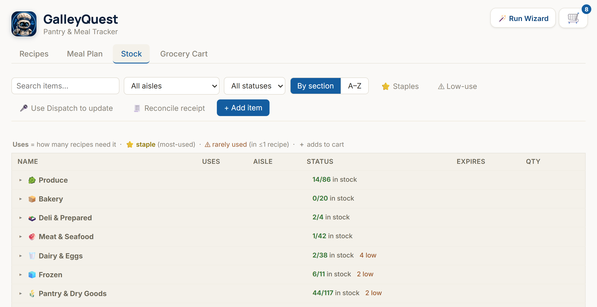
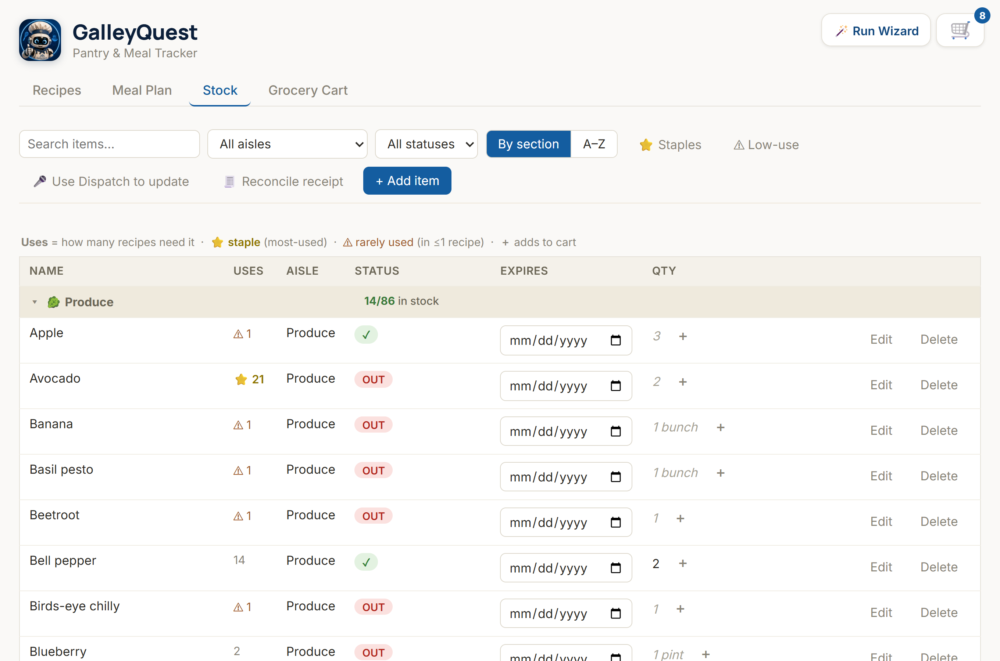
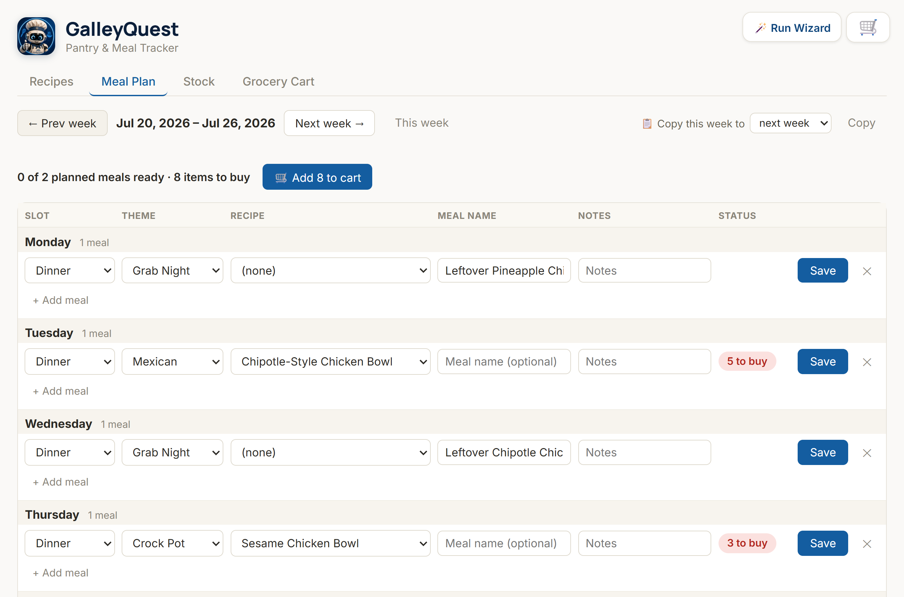
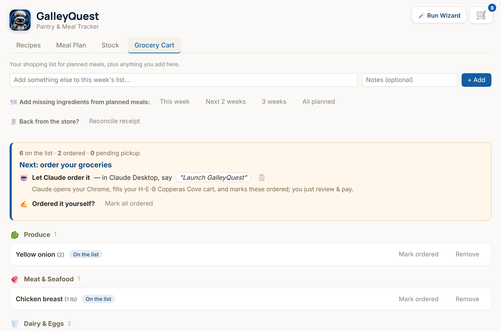
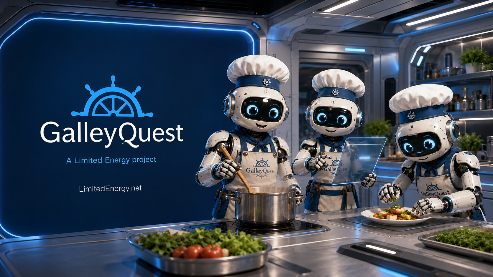

# 🍽️ GalleyQuest

[](LICENSE)

**A household pantry, recipe, and meal-planning app that answers the real daily question — _"what can I actually cook right now, and what do I need to buy?"_ — and then lets Claude do the shopping.**

Track what's in your pantry, see every meal you can make from it, plan the week, and turn that plan into a smart, waste-aware grocery cart. It's a dependency-free static frontend backed by Supabase (Postgres) — no build step, no framework — with a pair of Claude workflows that capture your pantry by voice and fill your grocery cart for you.



---

## Contents

- [What it is](#what-it-is)
- [Where it started, and what this fork adds](#where-it-started-and-what-this-fork-adds)
- [Feature tour](#feature-tour)
- [🤖 Built for Claude](#-built-for-claude)
- [Under the hood](#under-the-hood)
- [The recipe-maintenance toolkit](#the-recipe-maintenance-toolkit)
- [Quick start](#quick-start)
- [Roadmap](#roadmap)
- [Credits](#credits)

---

## What it is

Most pantry apps are glorified lists. GalleyQuest is built around a different idea: your inventory should _do something for you_. Every screen is organized around a decision you actually make —

- **"What can I cook tonight?"** → **Recipes → 🔥 Cook Now** filters to just the meals you can make now (≥85% of ingredients on hand).
- **"What do I have?"** → **Stock** is your pantry, grouped by supermarket aisle, with usage and expiration insight.
- **"What's the plan?"** → **Meal Plan** is a weekly grid that knows what each meal still needs.
- **"What do I buy?"** → **Grocery Cart** is a real shopping list with a lifecycle, built from your plan — and shoppable by Claude.

It also has a point of view about **waste**: it rates recipes by how *pantry-efficient* they are, flags ingredients that only ever serve one dish, understands interchangeable ingredients (have shortening, need lard? you're covered), and refuses to buy perishables weeks before you'll cook them.

---

## Where it started, and what this fork adds

GalleyQuest began as a **small self-hosted pantry/recipe/meal-plan tracker** (forked from [`arentovey-lang/GalleyQuest`](https://github.com/arentovey-lang/GalleyQuest)). The base app provided the five-tab skeleton, the Supabase backing, and a starter set of ~28 recipes. It answered *"what's in the pantry?"* — but not *"so what should I do about it?"*

**This fork turns it from an inventory list into a decision engine.** The major additions:

| Area | What was added |
|------|----------------|
| **Scale & data quality** | Grew ~28 → **262 recipes** and a **~497-item, food-only pantry** (aisle-categorized, no household clutter); a clean taxonomy (11 cuisine families, meal-time categories); consolidated duplicate/variant ingredients; and a recipe collection curated with an **anti-inflammatory, gut-friendly lean**. |
| **Intelligence** | Computed **efficiency ratings**, **AKA / interchangeable ingredients**, single-use ingredient flags, a staples view, and coverage analysis — readiness now understands substitutes and won't double-buy. |
| **Smart grocery** | **Multi-week** cart building from the meal plan (this week → all planned), a **perishable expiration hold** so you don't buy milk three weeks early, an aisle-grouped list, and an on-list → ordered → picked-up lifecycle that **restocks the pantry** when you're done. |
| **UX overhaul** | Consistent 3-row recipe cards, 1–5⭐ ratings, sticky toolbars + table headers, inline expiration date pickers, general-quantity suggestions, one-click add-to-cart, and desktop scaling that reads well at 100% zoom. |
| **🤖 Claude-native** | Update your whole pantry **by voice** through Claude, and have Claude **fill your H-E-B cart** from the shopping list. |
| **Tooling** | A credential-free `recipe-maintenance` Python toolkit for backup, verification, consolidation, and coverage. |

---

## Feature tour

### 📖 Recipes — with 🔥 Cook Now
262 recipes in a consistent, scannable card layout. Every card shows the same three rows — **name + on-hand ratio**, **category · cuisine**, and **ratings** — plus, when expanded, the full ingredient list with per-item OK/OUT status and one-click **add-missing-to-cart**. Rate what you've tried (1–5⭐) and read each recipe's computed 🌿 **efficiency** rating. Filter by category, cuisine, or search — flip **🌿 Efficient** for lean, pantry-friendly meals, or **🔥 Cook Now** to show only what you can make right now (**≥85% of tracked ingredients on hand**, most-ready first).

Flip **🔥 Cook Now** and the list narrows to just what you can make right now:



Expand any card for the full ingredient list with per-item status and one-click add-to-cart:



### 🥫 Stock
Your pantry, grouped into real supermarket aisles. Each aisle header shows an at-a-glance roll-up (`7/74 in stock · 1 low`) and an ⏰ expiring flag.



Expand an aisle and every item gives you:
- **Status** — OK / LOW / OUT
- **Uses** — how many recipes rely on it (⭐ staple, ⚠ rarely used), with one-click **Staples** / **Low-use** filters
- **Expires** — an inline date picker; click the cell and set it
- **Qty** — a sensible general shopping unit (eggs → dozen, milk → gallon, meat → lb)
- **＋** — add straight to the grocery cart



### 📅 Meal Plan
A weekly grid — pick a theme and a recipe per day. Themes **cross-reference** cuisines (choose *Mexican* and the recipe list narrows to Tex-Mex / Southwest), each day shows live readiness (*"✓ ready"* / *"3 to buy"*), and one button pulls the week's missing ingredients into the cart.



### 🛒 Grocery Cart
A real shopping list with a lifecycle: **on list → ordered → picked up**. Pull in missing ingredients from your planned meals across a horizon you choose — **this week, next 2 weeks, 3 weeks, or all planned** — and perishables needed too far out are **held back with a warning** so nothing spoils before you cook it. When you mark items picked up, the pantry restocks itself. And at the top: a one-line handoff to let **Claude place the order for you.**



---

## 🤖 Built for Claude

GalleyQuest is designed to be driven by an AI assistant, not just clicked. Two Claude workflows remove the two most tedious chores — *keeping the pantry current* and *placing the order*.

### 🎤 Update your pantry by voice
Standing at the fridge with your hands full is exactly when you don't want to type. On your phone, open **Claude → Dispatch** (connected to the machine hosting GalleyQuest) and say *"Update my pantry,"* then just talk:

> *"We have a half gallon of milk, a dozen eggs, two pounds of ground beef, out of flour, low on olive oil."*

Claude parses that into structured stock updates and writes them straight to the database — no forms, no copy-paste.

### 🛒 Let Claude fill your cart
When the shopping list is ready, the Grocery Cart shows a handoff: in **Claude Desktop**, say *"Launch GalleyQuest."* Claude reads your list, opens **your** Chrome, and fills your **H-E-B Copperas Cove** curbside cart — starting from *Buy It Again* for staples, then searching for the rest, and marking each item ordered as it goes.

It deliberately **stops before checkout** — you handle sign-in, any CAPTCHA, and payment. Claude never touches your credentials or places the final order; it just does the 20 minutes of clicking.

_(The workflows live as Claude "skills"; the browser automation uses your real, logged-in Chrome so you can watch it work.)_

---

## Under the hood

| Layer | Choice |
|-------|--------|
| **Frontend** | A single `index.html` + `ui-cards.js`, vanilla JS, no framework, no build |
| **Backend** | Supabase (Postgres) via PostgREST, anon-role CRUD |
| **Server** | Dependency-free Node static file server (`server.js`) |
| **Taxonomy / ratings** | Stored as lines in `recipes.notes` (`Cuisine:` / `Category:` / `Tags:` / `Rating:`) — **no schema changes required** |

A few design decisions worth calling out:

- **No-DDL taxonomy.** Rather than alter the schema, cuisine/category/tags/ratings ride inside each recipe's notes field and are parsed at runtime. The whole app runs against a plain Supabase project with only anon-role CRUD.
- **Efficiency rating.** `penalty = ingredient count + 2 × single-use ingredients + used-in-2 ingredients` (excluding always-on-hand staples), bucketed into 1–5 🌿 stars. Few common ingredients → 5; many with rare ones → 1.
- **AKA substitutes.** Curated interchangeable groups (e.g. `Lard ↔ Shortening`, `Corn starch ↔ Potato starch`) — if any group member is in stock, the recipe counts it as covered and it never gets added to the cart.
- **Perishable holds.** Aisle-based windows (produce/bakery ≤ 1 week ahead, meat/dairy ≤ 2 weeks) decide whether a future meal's ingredient is bought now or held for a closer trip.

---

## The recipe-maintenance toolkit

`tools/recipe-maintenance/` is a small, **credential-free** Python toolkit (reads `config.js` at runtime, standard library only) for data upkeep:

| Script | Purpose |
|--------|---------|
| `backup_db.py` | Read-only export of all tables + a manifest |
| `verify_recipe_database.py` | Integrity checks (no orphans, every ingredient has a quantity, …) |
| `consolidate_ingredients.py` | Merge duplicate/variant stock items into canonical ones |
| `coverage.py` | How many recipes are makeable from a set, and the best next additions |
| `link_stock.py` / `stock_from_recipes.py` | Link recipe ingredients to pantry items and build out stock |
| `stock_cli.py` / `grocery_cli.py` | Voice-pantry ingest and grocery-list operations |

Run any of them with `python <script>.py` from `tools/recipe-maintenance/`.

---

## Quick start

No `npm install` — there are no dependencies.

1. **Create a Supabase project** with these tables: `stock_items`, `recipes`, `recipe_ingredients`, `meal_plan`, `grocery_extra_items`, `grocery_dismissed_items`.
2. **Configure credentials** — copy `config.example.js` to `config.js` and fill in your project URL + anon key:
   ```bash
   cp config.example.js config.js   # then edit config.js
   ```
   `config.js` is git-ignored — **never commit real credentials.**
3. **Run it:**
   ```bash
   node server.js                   # serves on http://localhost:8000
   ```

Full operational details are in [`docs/OPERATIONAL_HANDOFF.md`](docs/OPERATIONAL_HANDOFF.md).

---

## Roadmap

Ideas on deck (not yet built):

- **Per-item store memory** — remember the exact H-E-B product chosen for each ingredient.
- **Smarter general quantities** — refine the produce/bulk unit heuristics over time.
- **Recurring meal schedules** — "every first week of the month" style repeats (copy-a-week already ships).

_Recently shipped: a merged **Recipes → 🔥 Cook Now** filter (≥85% ready), a **food-only pantry** cleanup, anti-inflammatory recipe curation, first-run wizard, multiple meals per day (meal slots), receipt reconciliation (grocery **and** stock), copy-a-week, and a full brand refresh + mobile overhaul._

---

## Credits

Forked from [`arentovey-lang/GalleyQuest`](https://github.com/arentovey-lang/GalleyQuest), which provided the original pantry/recipe/meal-plan foundation. This fork's enhancements — the efficiency lens, smart multi-week grocery, AI-native workflows, and UX overhaul — were built by [@LimitedEnergyX](https://github.com/LimitedEnergyX) in collaboration with Claude Code.

## License

Released under the [MIT License](LICENSE) © 2026 Shawn Tovey and Aren Tovey — the original pantry/recipe/meal-plan foundation is Aren's; this fork's enhancements are Shawn's. Use it, fork it, point it at your own grocery store.

---

<p align="center">
  <br>
  <sub><b>GalleyQuest</b> — A Limited Energy project</sub>
</p>
